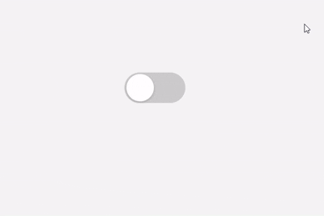

# 🌗 Modern Theme Toggle Switch

A sleek, modern, and responsive custom switch button built with HTML and CSS. This UI component is ideal for toggling between Light and Dark themes in a stylish way.

## Live Preview
https://sudhanshuverse.github.io/custom-ui-library/dark-light-toggle/index.html

## ✨ Features

- Custom-designed toggle switch UI
- Smooth animated transition
- Fully responsive and scalable using CSS variables
- Easy to integrate into existing projects
- Supports Light/Dark theme switching (JavaScript required)

---

## 🚀 Demo

---

